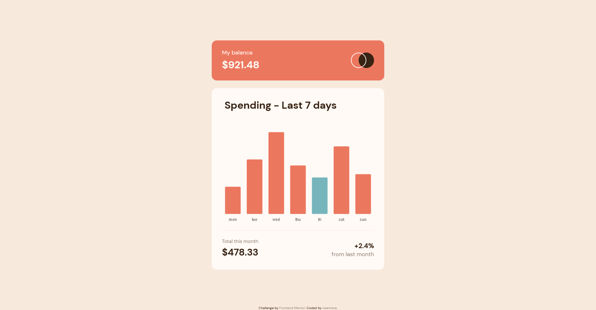

## Welcome! 👋

### Here's a quick look at my solution for the [Frontend Mentor](https://www.frontendmentor.io/home) challenge:

Expenses chart component



[Live Link](https://neenreva.github.io/expenses-chart-component-main/) [Solution Home](https://www.frontendmentor.io/challenges/expenses-chart-component-e7yJBUdjwt/hub/expenses-chart-component-JVqOmzPCbD)

## The challenge

Your challenge is to build out this bar chart component and get it looking as close to the design as possible.

You can use any tools you like to help you complete the challenge. So if you've got something you'd like to practice, feel free to give it a go.

We provide the data for the chart in a local `data.json` file. So you can use that to dynamically add the bars if you choose.

Your users should be able to:

- View the bar chart and hover over the individual bars to see the correct amounts for each day
- See the current day's bar highlighted in a different colour to the other bars
- View the optimal layout for the content depending on their device's screen size
- See hover states for all interactive elements on the page
- **Bonus**: See dynamically generated bars based on the data provided in the local JSON file

Want some support on the challenge? [Join our Slack community](https://www.frontendmentor.io/slack) and ask questions in the **#help** channel.

Users should be able to:

- View the optimal layout depending on their device's screen size
- See hover states for interactive elements

### Built with

- Semantic HTML5 markup
- CSS custom properties
- Flexbox
- Mobile-first workflow
- ChartJS

### What I learned

Libraries.. WOW. ChartJS might not be the best example but it's easy to see why these are useful and frustrating at the same time. I felt like ChartJS is currently well supported and has been around long enough to have the best 1st time experience with. I understand libraries well enough that each one has it's own quirks based on the dev/dev team behind them. I ran with a CDN(seemed easiest) added the canvas element and went to the js. I figured an IIFE was a good use and fetched the JSON data and instantiated the chart class. Kinda curious what thoughts are about this method. Maybe not best practices but the chart was up.

basic format looks like:

```js
const myChart = new Chart({
  type: '',
  data: {},
  options: {},
})
```

On top of it being the first library I've use I also don't have a lot of experience in using objects bit I felt like this was pretty straight forward. The nested options object became majority of the js being that formal decisions are made within the Chart instance. After scouring the docs I went back and forth and came out with something I feel good about. Most of the formal decisions are based on mobile first. This caused one problem that I know for sure and that is the overall height on the graph in desktop format. As much as I looked, I couldn't seem to manipulate it. In these projects I try not to get lost in details like this due to the time it could take figuring it out. That obviously would be different in a client-based project. I'll note it here and maybe get to fix it in the future. 

Overall I would recommend ChartJS for this challenge.

### Continued development

ChartJS had many features that I barely scraped the surface of or didn't even get into. Would like to revisit the library in a variety of use cases.

### Useful resources

- [Pixel Perfect](https://www.welldonecode.com/perfectpixel/) - Overlay that really helps with the sizing of the elements.
- [ChartJS](https://www.chartjs.org/docs/latest/) - Graphing Library. Super useful for rapid data visualations.

### As always feedback is welcome! Thanks for checking this out.
